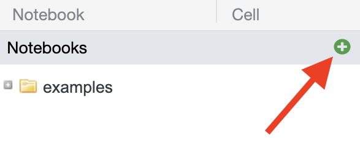
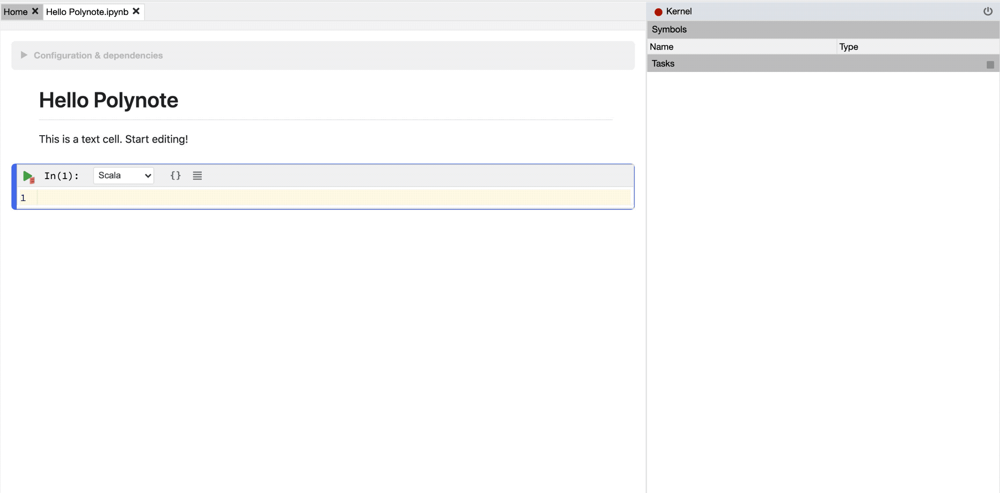

# Basic usage

!!! info
    This page aims to get you up and running with your first Polynote notebook. For a more in-depth walk through the 
    Polynote user interface, check out the [Tour](tour.md).

After starting Polynote and opening the application in your browser at http://localhost:8192/
you'll see the home page.


On the left is the list of notebook files. If you have just installed Polynote, the only notebooks you will have access 
to are our examples. Feel free to browse these notebooks for your future reference. 

## Creating a new notebook

For now, though, we'll just jump right into creating a new notebook.

{ align=left style="height:8em" }

{ align=right style="height:8em" }

Click the "New notebook" button (left), and a dialog will come up (right). Enter a name for your notebook
and then click "Create". 


The new notebook appears in the Notebooks Pane <span class="num">①</span>, and is opened in a Polynote tab 
<span class="num">②</span> with the Configuration Pane open <span class="num">③</span>.

We'll ignore the configuration for now, so click anywhere on the `▼ Configuration & dependencies` heading 
<span class="num">④</span> to close it. 

You'll see that the notebook contains a single text cell. Click on that cell and you'll see the text editing toolbar 
appear (shown boxed in the image below).


This contextual toolbar appears when it's useful, based on the currently active cell. You'll see it change as you 
interact with cells of various types. 

!!!tip ""
    Check out the [tour](toolbar.md) for a more comprehensive breakdown of the toolbar and the different cell types.

## Creating a new cell

A notebook document is made up of a collection of cells. Currently, Polynote supports three cell types: text cells, 
code cells, and visualization (viz) cells. 

[Text cells](text-cells.md) are useful for writing rich text explanations, [code cells](code-cells.md) contain 
the code that actually gets run in the notebook, and [viz cells](visualization-and-viz-cells.md) aid in inspecting and visualizing data. 

Now that we've seen a text cell, let's create a new code cell. If you hover the mouse above and below the text cell, 
you'll see a divider appear with a small `+` symbol. Clicking on that divider will create a new cell in its place. 

Go ahead and click on the divider below the text cell to create a new cell there.


This new cell is a code cell, with its language (by default) set to Scala. You can change the language with the dropdown 
– there's one right above the cell and one on the main toolbar. 

If you wanted another text cell instead, you can change it to Text as well (but only in the dropdown on the main toolbar) 
and it will turn into a text cell.


Let's enter some Scala code in the code cell. The code we're writing is just a little snippet for demonstration purposes. 
Here it is in case you're following along:


???example "Demonstation Code"
    ```scala
    import scala.util.Random.nextGaussian

    println("this is some console output!")

    val x = 50

    case class Point(x: Double, y: Double)
    List.fill(x)(Point(nextGaussian * 2 + 5, nextGaussian * 4))
    ```

Once you start typing, you'll see some activity on the right as the Kernel is started. The Kernel is what handles the 
computing the notebook code, including providing code completions and suggestions. Once it starts, you'll start seeing 
interactive completions as you type. 

Run the code cell by pressing ++shift+enter++. The cell runs, and output is displayed. 

Here's what you should see:



Let's take a closer look at the results of running the cell.


We can see that a few things happened after running the code:

- The console output from the `println` statement appeared in an area <span class="num">①</span> below the cell.
- The variable `x` defined in the cell appeared in the Symbol Table <span class="num">②</span> on the right.
- The final expression of the cell was bound to a variable called `Out` <span class="num">③</span> and some information 
  about it appeared below the console output <span class="num">④</span>.

Because the expression `:::scala List.fill(50)(Point(nextGaussian * 2 + 5, nextGaussian * 4))` results in "table-like" 
data – a collection of structured values – a special representation of it is displayed. In this Cell Result view, we
can see the result's schema (the fields of the structured row) along with its type and some icons. 

Clicking these icons creates a new viz cell below this one, allowing you to inspect the cell's result in more detail.
 
In addition to inspecting the "result" of the cell, any other value that's been bound to a variable can be inspected by 
clicking it in the Symbol Table. We'll now take a closer look at the Symbol Table, and how it changes as you interact
with the notebook. 

## The Symbol Table and input scope

If you create and run some more code cells, you'll notice that the Symbol Table changes depending on which cell is
currently focused. It shows you any values that resulted from the current cell above a thick black line, and any values
that are available to the cell (from previous cells) below the thick black line.


In the image above, you can see how the Symbol Table changes based on which cell is selected. This allows you to keep 
track of which variables are available, which is useful because Polynote keeps track of the cell input scope. 

Polynote is different from other notebook tools in that a cell's place in the notebook is important. Every cell has an
"input state" defined by the cells that have run above it. This means that if we create a code cell that defines a value:

```scala
val foo = 20
```

Then another cell below it can use the value `foo`:

```scala
val bar = foo * 2
```

But, if we then go back and edit the first cell like this:

```scala
val foo = 20
val fail = bar * 2
```

It won't work! 

The value `bar` isn't in the input scope of the first cell, because it was defined in the second cell.
This is very different from how other notebook tools operate; they just have one global state that every cell mutates.

In Polynote, the input state of a cell is defined completely by which cells are above it. This is a powerful way to
enforce **reproducibility** in a notebook; it is far more likely that you'll be able to re-run the notebook from top to
bottom if later cells can't affect earlier cells.

Here's an example of the above scenario in practice (reordering the cells rather than editing their content):


Next, read about [mixing programming languages](mixing-programming-languages.md).
